# Gaussian Splatting For Unreal Engine
**GaussianSplattingForUnrealEngine** 是一个虚幻引擎插件，它可以轻易将虚幻中的图形转换为高质量的3D高斯点云：

如果还不了解什么是3DGS，可以查看这篇文档：

- https://italink.github.io/ModernGraphicsEngineGuide/04-UnrealEngine/16.3DGaussianSplatting/

该插件支持以下功能：

- 提供简单易用的编辑器工具来完成：
    - 图形捕获
    - 稀疏点云重建
    - 高斯训练
- 支持高斯点云（`*.ply`）的导入，在虚幻中以 **GPU粒子** 或 **静态网格体** 为载体进行渲染
- 让3D高斯更接近工业生产，提供了一些非常有用的机制：
    - 精细化的深度修剪：有效剔除漂浮噪点
    - 基于屏幕尺寸的LOD策略：基于高斯点的特征，高效调控粒子的数量和内存

3D高斯具有如下优缺点：

- 优点：
    - 基于【点】表达相较于三角形，更适用于制作粒子特效
    - 基于图像特征识别的重建，相较于传统的网格简化，通常具有更好的简化效果，非常适合用于制作大范围区域的视觉代理
    - 无纹理数据，仅存在基于特征的顶点数据，可微的特性也让它可以进行自由裁剪和压缩
- 缺点：
    - 使用半透明叠加的方式进行渲染，需要对图元进行半透明排序，且 OverDraw 较高
    - 仅还原了物体在视觉上的颜色表达，无法或很难还原物体实际的物理属性，因此不能营造动态的光影效果

## 环境要求

- **Unreal Engine 5.5 +**
- **Colmap** ：https://github.com/colmap/colmap
- **Gaussian Splatting** ：https://github.com/graphdeco-inria/gaussian-splatting

> 该插件的执行建立在上述仓库的命令行接口之上，请确保搭建正确的运行环境。

## 使用手册

- [此处](https://drive.google.com/file/d/1gyKlCQacUsZUX6rXSKW1joyVxIYsBnHM/view?usp=drive_link)可以获取测试所生成的高斯点云。
- 如果厌倦密集的文字说明，[此处](https://www.bilibili.com/video/BV1GUwNeYE6c)还有一个不那么友好的视频演示。

### 安装插件

- 克隆最新的插件代码到项目工程的`Plugins`目录下：

- 安装完成之后可以在虚幻引擎的编辑器模式中找到 **Gaussian Splatting Mode** ：

    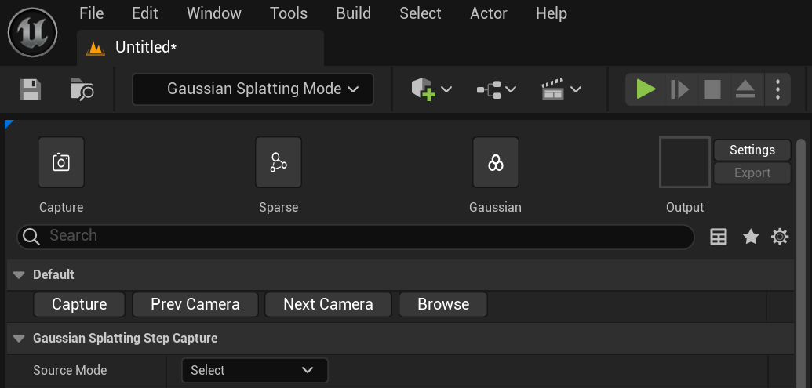

- 首次执行需要在编辑器面板的【Settings】页面指定相关的目录：

    

### 执行相机捕获

- 该步骤的目标在于构建一组相机阵列，生成稀疏重建和高斯训练所需的数据集。

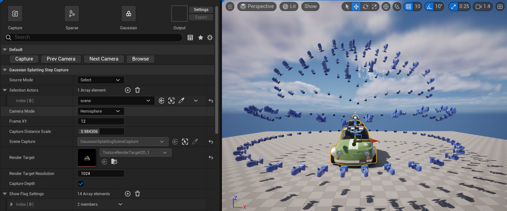

#### 构建相机阵列

构建相机阵列的方式有三种：

- **Select** ：通过选中物体来确定需要捕获的场景图形
- **Locate** ：通过一个 `LocateActor` 来锚定捕获的中心点，再通过设置 `HiddenActors` 来排除不需要捕获的场景图形
- **Custom** ：以自定义的方式添加相机位，再通过设置 `HiddenActors` 来排除不需要捕获的场景图形

 **Select** 模式适用于单个或少量图形的捕获，我们可以在场景中按住`Ctrl`键来多选图形，也可以在场景大纲中进行选择，相机阵列将会以选中图形的包围盒来自动更新相机位置：

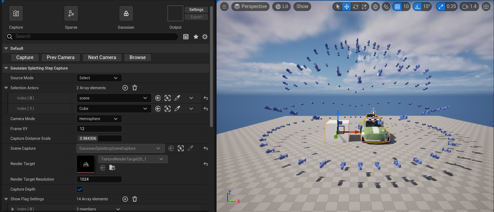

- `Camera Mode`：可以选择上半球或者全球捕获
- `Frame XY` ：相机矩阵的尺寸，`12` 意味着 `144 (12 x 12)` 个相机位。通常情况下，100+个机位足以用于构建高斯，但如果捕获的场景有较大的区域或者细节，可以尝试增加到300以上。

- `Capture Distance Scale`：用于动态伸缩相机的距离，通常它的调整要打开 `Render Target` 的编辑视图，来查看捕获的RT是否涵盖图形的全部区域，可以通过以下手段来调整当前预览的机位：
    - 点击按钮【Prev Camera】和【Next Camera】
    - 在场景直接选中 相机 模型
    - 在场景大纲中，ScreenCaptureActor的子列表中选中相机机位

- `Scene Capture`：用于捕获图形的虚幻组件，点击右侧的箭头可以选中它，对参数进行微调
- `Render Target Resolution`：捕获的图像尺寸，colmap 建议图像尺寸不超过 `3200`， gs 建议图像尺寸不超过 `1600`，这个界限是可以突破的，但较大的图像尺寸在训练时通常需要占用非常多的显存
- `Capture Depth`：是否需要捕获深度图，通常使用深度图可以更好的修剪高斯训练产生的浮空噪点
- `Show Flag Setting`：暴露 `Screen Capture` 显示标识的设置，显示标识将影响图像的捕获效果，常用的有：
    - Dynamic Shadow： 动态阴影开关
    - Ambient Occlusion： 环境遮蔽开关
    - Translucency： 半透明开关

**Locate** 模式适用于大范围场景的捕获，切换到 **Locate** 模式，将在场景中场景一个 Locate Actor，在编辑器面板上点击`Locate Actor`右侧的箭头可以选中它，调整 Locate Actor 的位置和缩放可以控制相机阵列的位置：

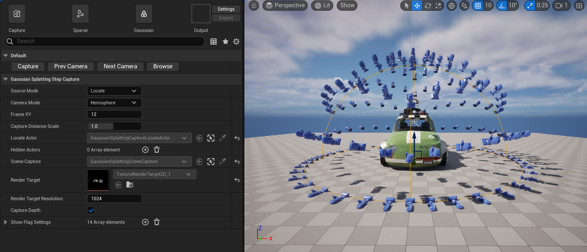

- `Hidden Actors`：需要排除的图形

**Custom** 模式用来自定义相机机位，切换到 **Custom** 模式，编辑器面板中显示 `Camera Actors` 选项，点击 【+】新增时会在当前编辑器视口位置添加新的机位：

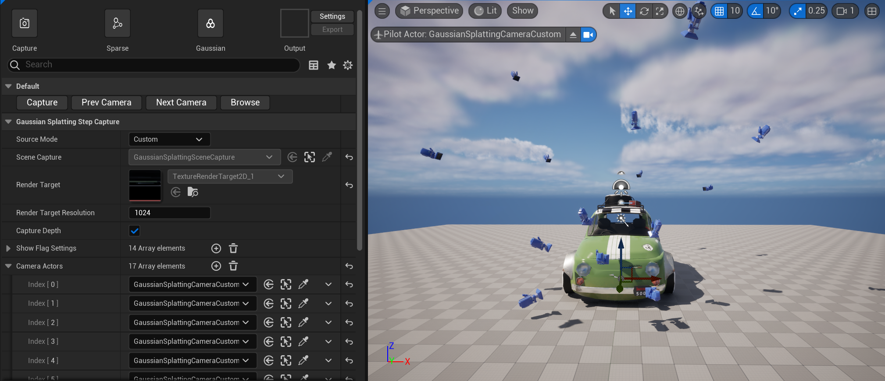

在构建好相机阵列和设置好捕获配置后，点击【Capture】按钮，将在插件的工作目录下生成数据集，点击右侧的【Browse】 图标，可以浏览捕获结果：

- `depths`：深度图
- `images`：原始图像
- `masks`：遮罩
- `cameras.txt`：相机的位置信息

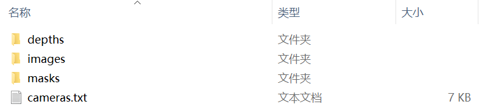

确保捕获的原始图像没有太大问题，就可以进行下一个步骤。

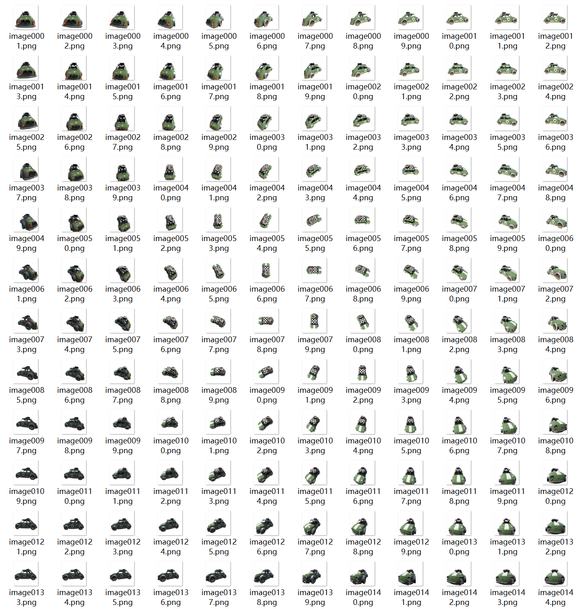

### 执行稀疏重建

- 该步骤本质上是在调用 [colmap](https://github.com/colmap/colmap) 的命令行程序来完成稀疏点云的重建。

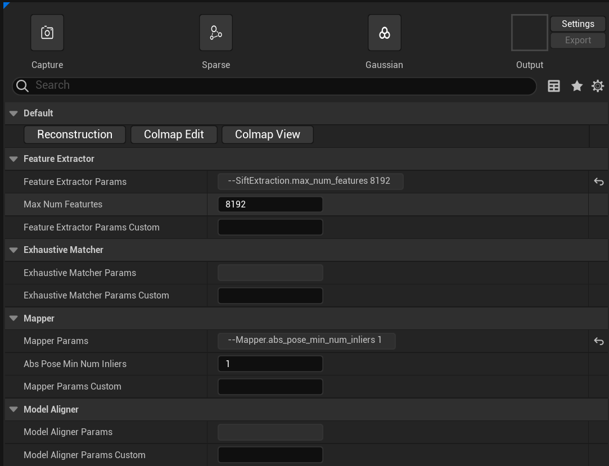

通常情况下，只需要点击 【Reconstruction】来执行稀疏重建，控制台可以观察到执行的日志，在结束后点击 【Colmap View】 可以查看重建的结果是否存在明显异常，如果不存在明显异常就可以进行下一步骤。

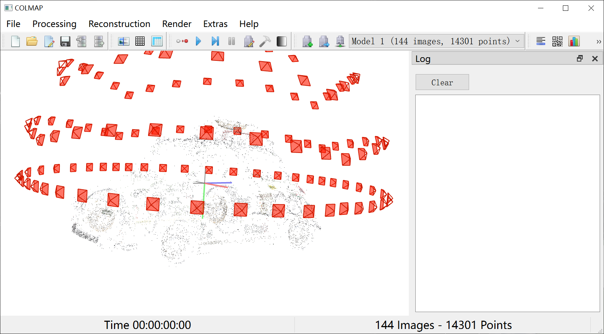

很少情况下会出现异常情况，但为了以防万一，增加了 colmap 各个阶段执行的扩展参数，你可以依据以下文档来调整测试：

- https://colmap.github.io/
- https://github.com/mwtarnowski/colmap-parameters
- https://github.com/colmap/colmap/issues

也可以点击 【Colmap Edit】在 Colmap GUI中手动进行稀疏重建，只需将最终的结果导出到工作目录的`./sparse/0/`中：

- 通常是 `{PluginDir}/WorkHome/GaussianSplattingEditor/sparse/0/`

###  执行高斯溅射

- 该步骤本质上是在调用 [gaussian-splatting](https://github.com/graphdeco-inria/gaussian-splatting) 提供的算法来完成3D高斯的训练。

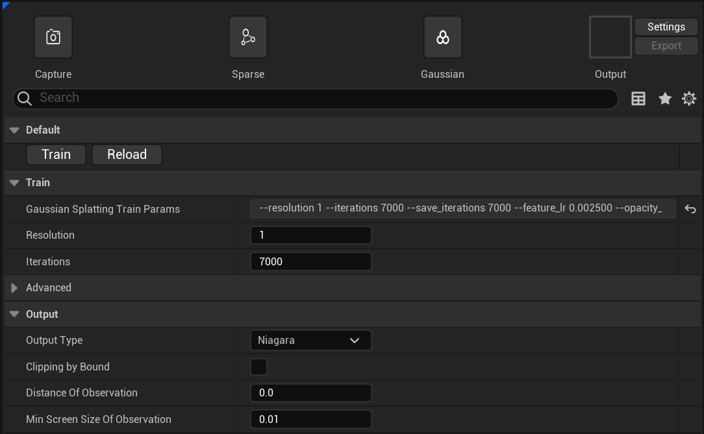

- `Resolution`：参与高斯训练时对图像分辨率的缩放系数，支持 `1`、`2`、`4`、`8`， `1` 表示不缩放， `2` 表示缩放为原图像的 `1/2`
- `Iterations`：高斯训练的迭代次数，通常 `7000 ` 次迭代能得到一个基本可观察的结果，`30000` 次迭代能得到更好的效果。
- `Advanced`：高斯训练的高级参数，详细配置请参阅 [gaussian-splatting](https://github.com/graphdeco-inria/gaussian-splatting) 的 `README.md`

点击【Train】将开始执行高斯训练，在此之前，插件会执行一次深度修剪，执行完成后，将应用 Ouput 类别下的编辑器设置，对高斯点云进行后处理：

- `Output Type`：生成结果在虚幻引擎中的存储载体，可以是 Niagara粒子 或者 静态网格体
- `Clipping By Bound`：是否要使用捕获图像时的包围盒对点云进行裁剪
- `Distance Of Observation`：将以该值作为观察距离来评估每个高斯点的屏幕尺寸，用于生成后的裁剪，如果为0，则表示不进行裁剪
- `Min Screen Size Of Observation`： 裁剪掉屏幕尺寸小于该值的高斯点

> 点击【Reload】按钮将重新执行后处理过程。

最终执行结束将在【Output】框中展示最终生成的结果，点击【Export】按钮可以将结果转储到项目目录中：

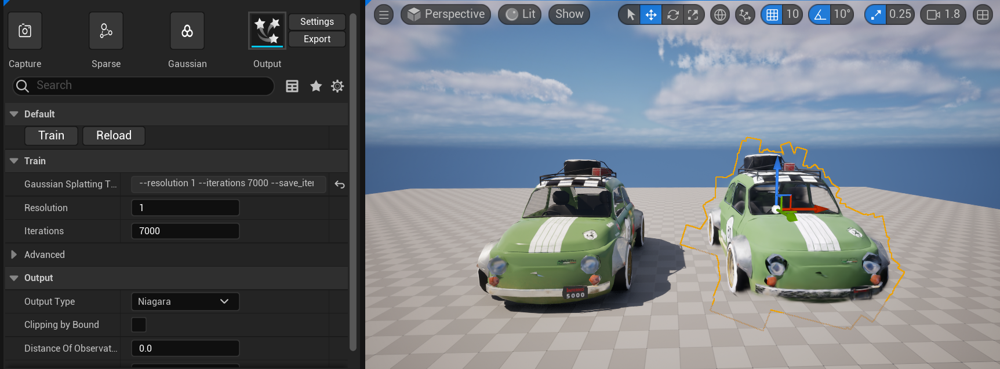

导致后直接点击资产可以打开一个简易的高斯点云编辑器：

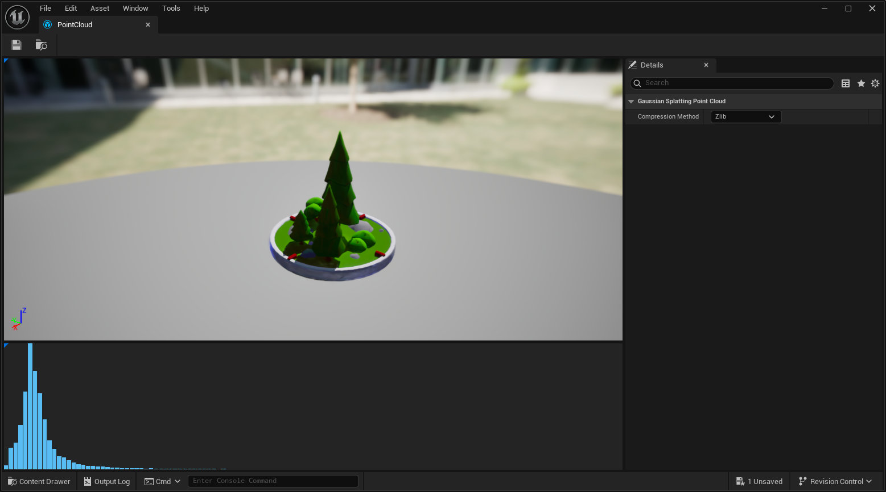

下侧的柱状图表示的高斯点的尺寸分布，目前支持的操作有：

- 鼠标在柱状区域拖拽可以进行选择高斯点
- 键盘按住 `Ctrl` + `Alt` 可以在视口中拖拽鼠标框选高斯点
- 按下`Delete` 可以删除当前选中的高斯点
- `Ctrl + Z` /  `Ctrl + Y` 为撤销重做

高斯点云资产拖拽到场景会生成一个NiagaraActor，也可以导出独立的 Niagara System：

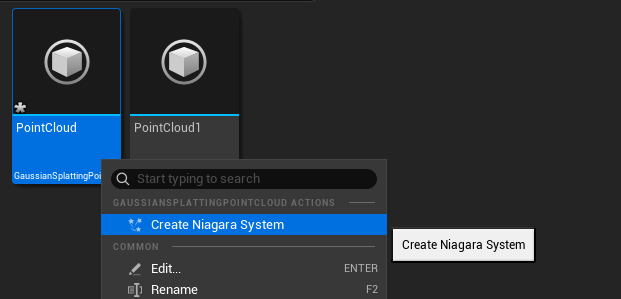

## LOD

粒子形式的高斯点云可以自动剔除掉小于某个屏幕尺寸的高斯点，以此来减少系统的调度和内存的开销：

可以在粒子系统的参数面板来修改 `MinFeatureScreenSize` 来修改单个粒子系统剔除的阈值

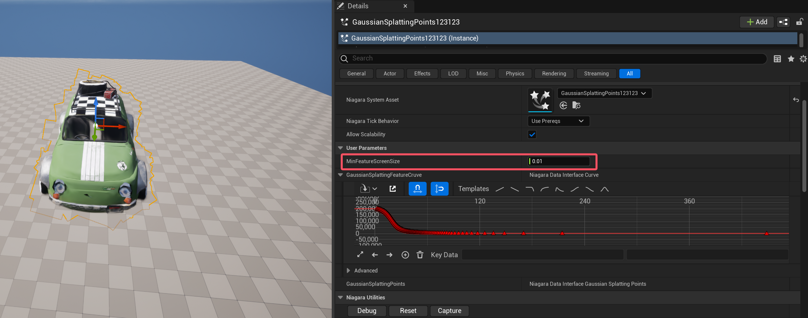

也可以使用控制台参数来进行全局的调整：

- `r.GaussianSplatting.ScreenSizeBias`：屏幕尺寸计算时的偏移，默认为 `0` 
- `r.GaussianSplatting.ScreenSizeScale`：屏幕尺寸计算时的缩放系数，默认为 `1`

## 自定义高斯算法

虚幻引擎提供了非常便利的编辑器，借助此插件可以快速的生成一些合成数据集，如果有算法定制化或测试的需求，在插件目录的 `/WorkHome/Scripts/.`下找到该插件所使用的 `python` 脚本：

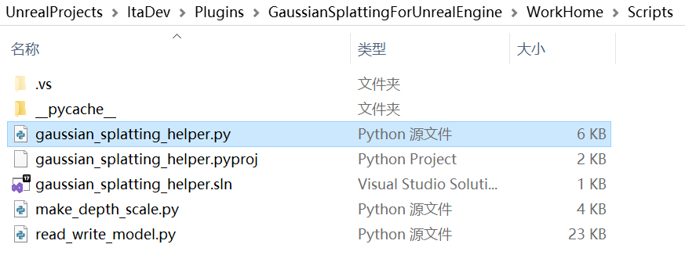

实际上编辑器中的绝大数操作，都是在通过命令行参数去执行 `gaussian_splatting_helper.py`，可以按需对其进行调整。
